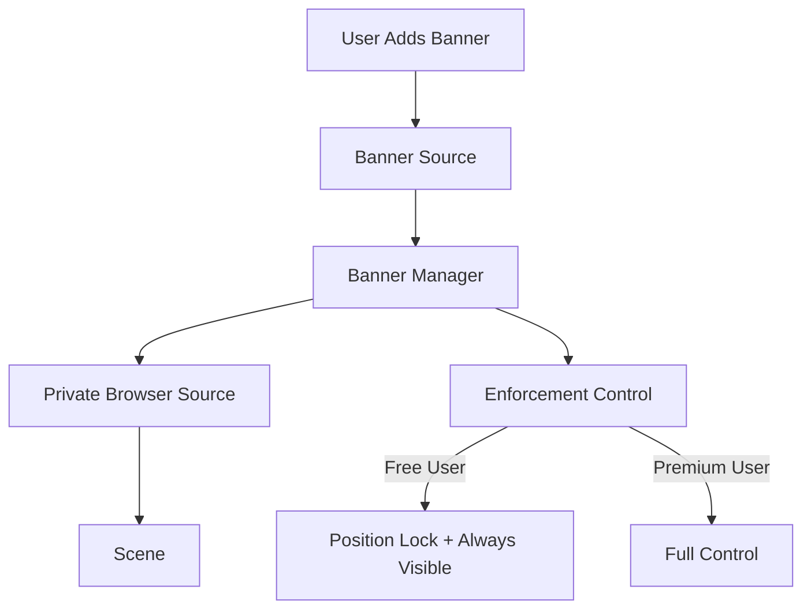
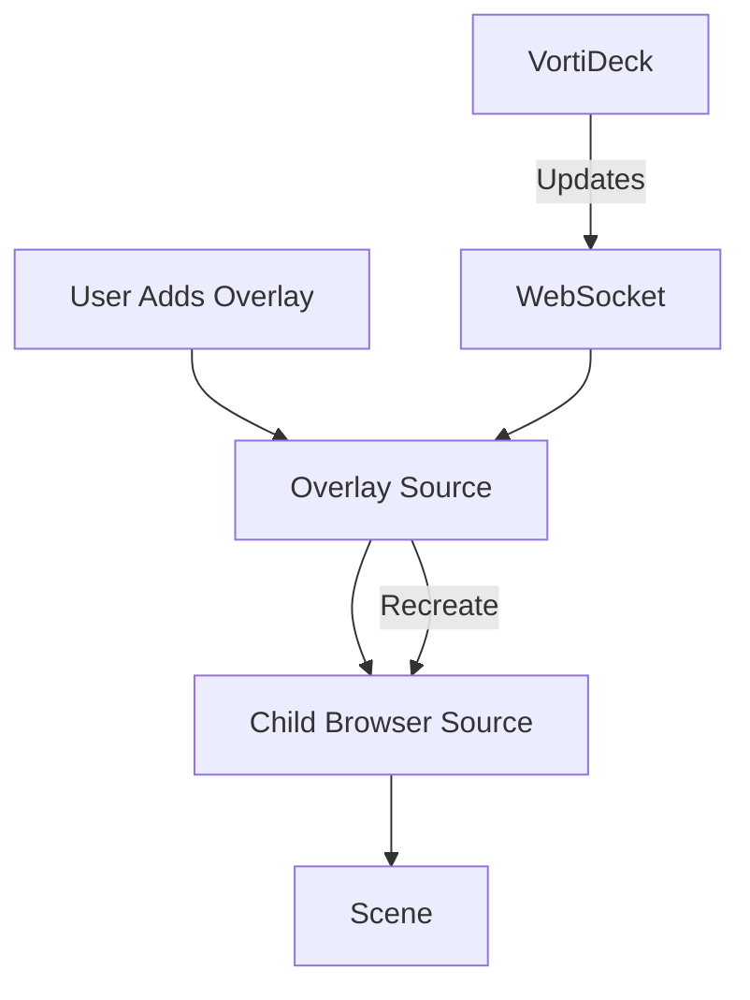

# VortiDeck Banners (ADS) vs Overlays - Technical Comparison

## Overview

Both Banners and Overlays are **browser-based sources** in OBS, but they serve different purposes and have different restrictions based on user premium status.

## Key Differences

| Feature | Banners (ADS) | Overlays |
|---------|---------------|----------|
| **Purpose** | Advertisement display | General content overlay |
| **Premium Restrictions** | Yes - Free users have limitations | No - Full features for all users |
| **Position Control** | Locked at top for free users | Fully customizable |
| **Visibility Control** | Forced visible for free users during streaming | User-controlled |
| **Default URL** | `/banners` | `/overlay.html` |
| **Source Type** | Private browser_source | Wrapped browser_source |
| **Auto-resize** | Always full canvas | Optional (forced for main overlay) |
| **Multiple Instances** | One managed instance | Multiple overlays supported |

## Common Browser Source Behaviors

Both systems use OBS's `browser_source` internally and share these configurations:

```cpp
// Common browser source settings for both
obs_data_set_string(settings, "url", url_content.c_str());
obs_data_set_int(settings, "width", canvas_width);
obs_data_set_int(settings, "height", canvas_height);
obs_data_set_int(settings, "fps", 30);
obs_data_set_bool(settings, "reroute_audio", false/true);
obs_data_set_bool(settings, "shutdown", false);
obs_data_set_string(settings, "css", css_content.c_str());
```

### Shared Features:
1. **Canvas Size Matching** - Both can match OBS canvas resolution
2. **CSS Injection** - Custom styling support
3. **URL-based Content** - Load from HTTP endpoints
4. **Signal Monitoring** - React to canvas size changes
5. **WebSocket Integration** - Receive updates from VortiDeck

## Banner (ADS) Management

### How Banners Work:



### Banner Creation Flow:

1. **Menu Integration**:
   ```cpp
   // User selects "VortiDeck Banner" from sources menu
   banner_source_create() {
       // Triggers banner_manager
       auto& banner_mgr = get_global_banner_manager();
       banner_mgr.set_banner_content(url, "url");
       banner_mgr.show_banner();
   }
   ```

2. **Banner Manager Creates Private Source**:
   ```cpp
   // Creates a private browser_source
   m_banner_source = obs_source_create_private("browser_source", 
                                              m_banner_source_name.c_str(), 
                                              settings);
   ```

3. **Free User Enforcement**:
   ```cpp
   // For free users - lock position and ensure visibility
   obs_sceneitem_set_order(banner_item, OBS_ORDER_MOVE_TOP);
   obs_sceneitem_set_locked(banner_item, true);
   ```

### Banner Content (Simplified):

```cpp
// Banners now work exactly like overlays - always use connected service URL
std::string banner_url = connected_service_url + "/banners";
banner_mgr.set_banner_url(banner_url);
// No more complex content types - just direct URLs like overlays
```

## Overlay Management

### How Overlays Work:



### Overlay Features:

1. **Automatic URL Construction**:
   ```cpp
   // Builds URL from connected WebSocket server
   if (websocket_url.starts_with("ws://")) {
       base_url = "http://" + websocket_url.substr(5);
   }
   base_url = base_url + "/overlay.html";
   ```

2. **Browser Recreation on Updates**:
   ```cpp
   // Forces browser recreation to fix viewport caching
   if (force_recreation) {
       obs_source_remove_active_child(context->source, context->browser_source);
       obs_source_release(context->browser_source);
       // Create new browser source with updated dimensions
   }
   ```

3. **Main Overlay Special Handling**:
   ```cpp
   if (context->overlay_id == "main_overlay") {
       // Force auto-resize
       // Lock at position (0,0)
       // Stretch to full canvas
   }
   ```

## URL Management

Both systems automatically construct URLs from the connected VortiDeck service:

### Banner URL:
```cpp
// From WebSocket: ws://192.168.1.100:9001/ws
// Becomes: http://192.168.1.100:9001/banners
```

### Overlay URL:
```cpp
// From WebSocket: ws://192.168.1.100:9001/ws
// Becomes: http://192.168.1.100:9001/overlay.html
```

## WebSocket Actions

### Banner Actions (Simplified):
- `APPLET_OBS_BANNER_SHOW` - Display banner (uses connected service URL + /banners)
- `APPLET_OBS_BANNER_HIDE` - Hide banner (restricted for free users)
- `APPLET_OBS_BANNER_TOGGLE` - Toggle visibility
- ~~`APPLET_OBS_BANNER_SET_DATA`~~ - **REMOVED** - Banners now automatically use connected service URL

### Overlay Actions:
- `APPLET_OBS_OVERLAY_CREATE` - Create new overlay
- `APPLET_OBS_OVERLAY_UPDATE` - Update overlay (triggers recreation)
- `APPLET_OBS_OVERLAY_SET_DATA` - Update all overlays
- `APPLET_OBS_OVERLAY_REMOVE` - Remove overlay

## Premium vs Free User Differences

### Free Users (Banners):
```cpp
if (!m_is_premium.load()) {
    // Banner always on top
    obs_sceneitem_set_order(banner_item, OBS_ORDER_MOVE_TOP);
    // Position locked
    obs_sceneitem_set_locked(banner_item, true);
    // Visibility enforced during streaming
    if (obs_frontend_streaming_active()) {
        enforce_banner_visibility();
    }
}
```

### Premium Users (Banners):
- Full position control
- Can hide/show at will
- No forced visibility
- Custom positioning

### All Users (Overlays):
- Full feature access
- No restrictions
- Multiple overlays supported
- Complete positioning control

## Implementation Architecture

```
banner_source.cpp (Menu Wrapper)
    ↓
banner_manager.cpp (Core Logic)
    ↓
browser_source (OBS Native)

overlay_source.cpp (Direct Implementation)
    ↓
browser_source (OBS Native)
```

The key difference is that banners use a **manager pattern** for enforcement control, while overlays are **direct wrappers** around browser sources.

## Best Practices

1. **URL Consistency**: Both systems use the same base URL pattern
2. **Content Optimization**: Design responsive HTML that works at any resolution
3. **Performance**: Minimize DOM updates during streaming
4. **Error Handling**: Both systems handle disconnections gracefully

---

*This comparison shows how VortiDeck uses browser sources for both advertising (banners) and general content (overlays), with appropriate restrictions based on user tier.*