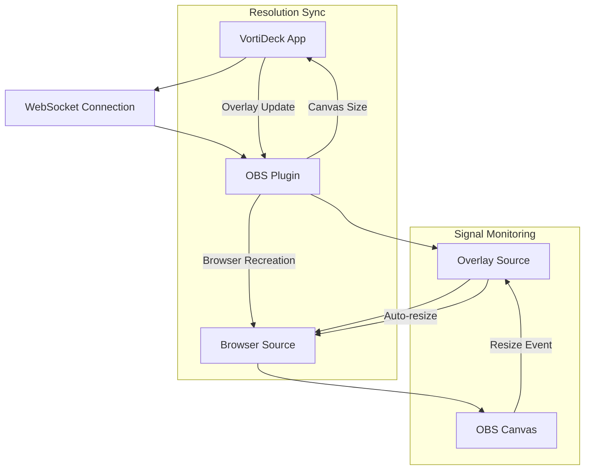
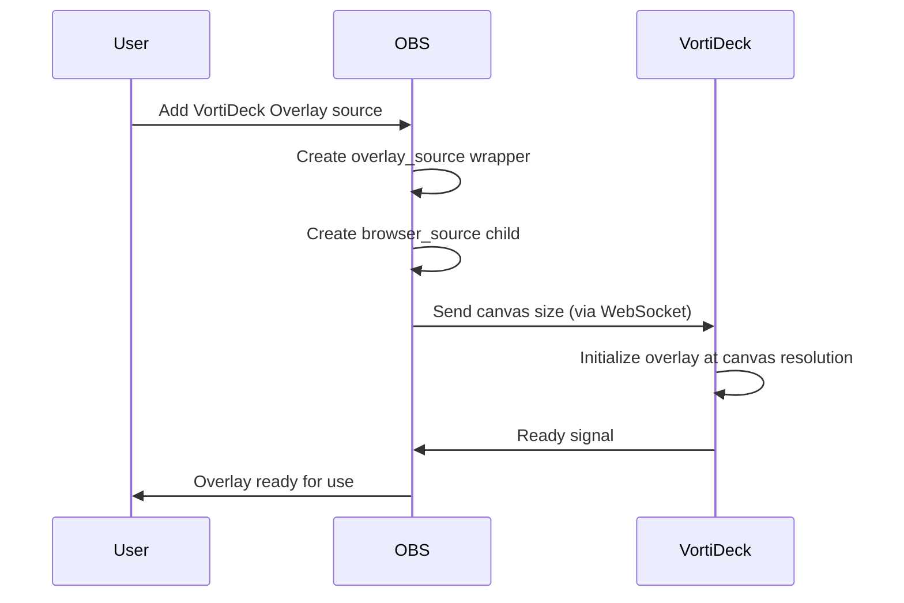
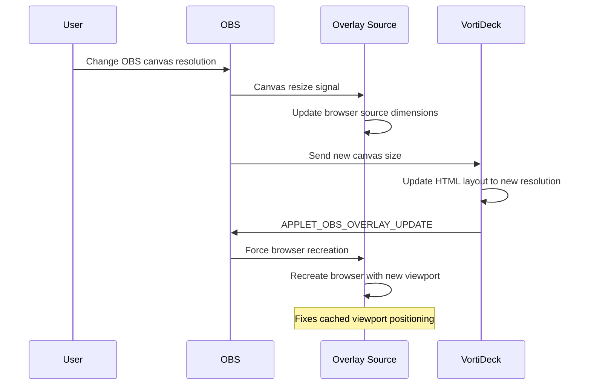
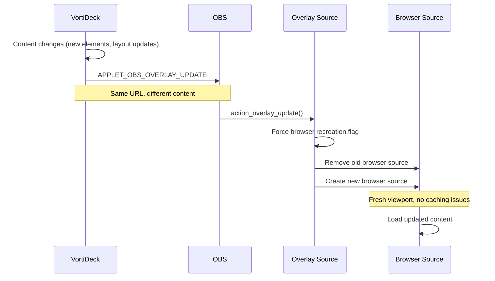

# VortiDeck Overlay System - Complete Guide

## Overview

The VortiDeck Overlay System provides seamless integration between VortiDeck applications and OBS Studio, enabling real-time overlay content updates with automatic resolution synchronization and positioning.

## System Architecture



## Key Components

### 1. VortiDeck Overlay Source (`overlay_source.cpp`)
- **Type**: Custom OBS source that wraps browser_source
- **Purpose**: Provides VortiDeck-specific overlay functionality
- **Features**:
  - Automatic canvas resolution matching
  - Browser source recreation on content changes
  - Main overlay locking and positioning
  - Signal-based resize monitoring

### 2. WebSocket Communication (`obs_plugin.cpp`)
- **Actions Supported**:
  - `APPLET_OBS_OVERLAY_CREATE` - Create new overlay
  - `APPLET_OBS_OVERLAY_UPDATE` - Update existing overlay
  - `APPLET_OBS_OVERLAY_SET_DATA` - Set overlay content
  - `APPLET_OBS_OVERLAY_REMOVE` - Remove overlay

### 3. Canvas Synchronization
- **Automatic**: OBS sends canvas size to VortiDeck on changes
- **Bidirectional**: VortiDeck updates overlay when content changes

## Workflow Diagrams

### 1. Initial Setup Flow



### 2. Resolution Change Flow



### 3. Content Update Flow



## Configuration

### Overlay Source Properties

```typescript
interface OverlaySourceSettings {
  overlay_id: string;          // "main_overlay" for primary
  url: string;                 // HTTP endpoint for content
  auto_resize: boolean;        // Match canvas size (forced true for main)
  width: number;               // Manual width (ignored if auto_resize)
  height: number;              // Manual height (ignored if auto_resize)
  css: string;                 // Custom CSS styling
}
```

### WebSocket Action Parameters

#### APPLET_OBS_OVERLAY_UPDATE
```json
{
  "actionId": "obs_overlay_update",
  "parameters": {
    "source_name": "VortiDeck Overlay",
    "width": "2560",
    "height": "1440",
    "url": "http://192.168.178.253:9001/overlay.html"
  }
}
```

#### APPLET_OBS_OVERLAY_CREATE
```json
{
  "actionId": "obs_overlay_create",
  "parameters": {
    "overlay_id": "main_overlay",
    "url": "http://192.168.178.253:9001/overlay.html",
    "source_name": "VortiDeck Overlay",
    "scene_name": "Scene 1",
    "width": "1920",
    "height": "1080"
  }
}
```

## Key Features

### 1. Automatic Resolution Matching
- **Main overlay** automatically resizes to match OBS canvas
- **Signal-based monitoring** detects canvas changes instantly
- **No manual configuration** required for resolution changes

### 2. Browser Source Recreation
- **Fixes viewport caching** when content changes at same URL
- **Triggered by VortiDeck updates** via APPLET_OBS_OVERLAY_UPDATE
- **Preserves all settings** (URL, CSS, audio routing)

### 3. Position Locking (Main Overlay)
- **Locked at (0,0)** position for consistency
- **Stretch bounds** to full canvas size
- **Prevents manual repositioning** for main overlay

### 4. Multi-Overlay Support
- **Multiple overlays** per scene supported
- **Independent configurations** for each overlay
- **Scene-specific** overlay management

## Troubleshooting

### Common Issues

#### 1. Elements Appear Shifted Right
**Cause**: Browser viewport cached at wrong resolution
**Solution**: Browser source recreation (automatic via APPLET_OBS_OVERLAY_UPDATE)

#### 2. Overlay Not Resizing
**Cause**: Auto-resize disabled or signal connection failed
**Solution**: 
- Check overlay properties (auto_resize should be true)
- Restart OBS to reconnect signals

#### 3. Content Not Updating
**Cause**: VortiDeck not sending update messages
**Solution**:
- Check WebSocket connection
- Verify action ID format (use internal "obs_overlay_update")

#### 4. Multiple Overlay Sources with Same Name
**Cause**: Missing OBS_SOURCE_DO_NOT_DUPLICATE flag
**Solution**: Already fixed in current implementation

### Debug Logging

Enable debug logs to see overlay operations:
```
[VortiDeck Overlay] Canvas resize detected: 2560x1441
[VortiDeck Overlay] FORCE_RECREATION: VortiDeck resolution update detected
[VortiDeck Overlay] FORCE_RECREATION: Successfully created new browser source
ACTION_OVERLAY_UPDATE: Comparing dimensions - current: 2560x1441, new: 2560x1441
ACTION_OVERLAY_UPDATE: No dimension change detected, but forcing recreation anyway
```

## Advanced Configuration

### Custom CSS for Overlays
```css
/* Prevent content shifting during updates */
.overlay-container {
  position: fixed;
  top: 0;
  left: 0;
  width: 100vw;
  height: 100vh;
  overflow: hidden;
}

/* Ensure consistent scaling */
.overlay-content {
  transform-origin: top left;
  transform: scale(var(--scale-factor, 1));
}
```

### Performance Optimization
- **Minimal recreation**: Only recreates when content actually changes
- **Signal-based**: No polling for resolution changes
- **Efficient memory**: Properly releases old browser sources

## Integration Examples

### VortiDeck App Integration
```rust
// Send overlay update to OBS
let obs_update_message = serde_json::json!({
    "integrationGuid": integration_guid,
    "actionId": "obs_overlay_update",
    "parameters": {
        "source_name": "VortiDeck Overlay",
        "width": width.to_string(),
        "height": height.to_string(),
        "url": server_url
    }
});
```

### OBS Script Integration
```lua
-- Get overlay source programmatically
local overlay = obs.obs_get_source_by_name("VortiDeck Overlay")
if overlay then
    local settings = obs.obs_source_get_settings(overlay)
    local width = obs.obs_data_get_int(settings, "width")
    local height = obs.obs_data_get_int(settings, "height")
    -- Use overlay dimensions
    obs.obs_data_release(settings)
    obs.obs_source_release(overlay)
end
```

## Best Practices

### 1. URL Management
- Use consistent base URLs across overlays
- Include cache-busting parameters if needed
- Prefer HTTP over file:// for better WebKit compatibility

### 2. Resolution Handling
- Always design overlays to be responsive
- Use viewport units (vw, vh) for consistent scaling
- Test at multiple resolutions (FHD, QHD, 4K)

### 3. Performance
- Minimize DOM updates during live streaming
- Use CSS transforms instead of layout changes
- Implement efficient update batching in VortiDeck

### 4. Error Handling
- Handle WebSocket disconnections gracefully
- Implement retry logic for failed overlay updates
- Log meaningful error messages for debugging

## API Reference

### Source Registration
```cpp
void register_overlay_source() {
    // Registers "VortiDeck Overlay" source type in OBS
}
```

### Key Functions
```cpp
// Canvas resize handling
static void handle_canvas_resize(void* data, calldata_t* cd);

// Overlay update from VortiDeck
void action_overlay_update(const action_invoke_parameters &parameters);

// Browser source recreation
void force_browser_recreation(overlay_source* context, int width, int height);
```

---

*This documentation covers the complete VortiDeck Overlay System as implemented in the current codebase. For questions or issues, refer to the troubleshooting section or check the debug logs.*